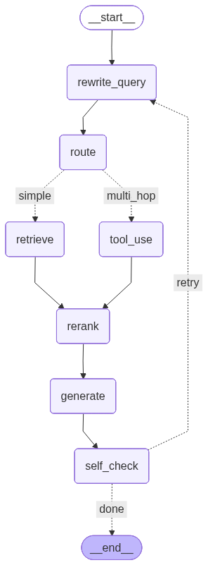

# Advanced RAG with LangGraph — Architecture

A self-correcting Retrieval-Augmented Generation system built on LangGraph,
implementing Anthropic's contextual retrieval technique, Cohere reranking, and
LLM-based grounded-answer verification with bounded retry loops.

The system answers questions over a small corpus of company documents. Every
retrieved chunk goes through a five-stage pipeline; the answer is checked for
groundedness before being returned, and low-confidence answers trigger a single
retry through the full pipeline before falling back to "I don't know."

## Pipeline diagram



The graph is implemented as a LangGraph `StateGraph` with seven nodes and two
conditional edges. The retry edge from `self_check` back to `rewrite_query` is
what makes this a graph rather than a chain.

## Stages

| Stage | Model | Purpose |
|---|---|---|
| `rewrite_query` | Haiku | Expand acronyms, add synonyms, dedupe |
| `route` | Haiku | Classify simple vs multi-hop |
| `retrieve` | (no LLM) | Cohere-embedded similarity search, top-20 candidates |
| `tool_use` | (stub) | Placeholder for multi-hop tools — currently falls back to `retrieve` |
| `rerank` | Cohere `rerank-english-v3.0` | Cross-encoder narrows top-20 → top-5 |
| `generate` | Sonnet | Grounded answer with inline citations |
| `self_check` | Haiku | Score groundedness 0.0-1.0; trigger retry if < 0.7 and attempts < 2 |

Cost-conscious model assignment: **80% of LLM calls use Haiku**; only the
user-facing generation step uses Sonnet.

## Why LangGraph instead of LCEL

Three features of this system would be awkward or impossible in a linear LCEL chain:

1. **Conditional routing** — `route` branches between `retrieve` and `tool_use`
   based on a runtime LLM classification.
2. **Cycles** — the `self_check → rewrite_query` retry edge requires graph
   semantics; LCEL is acyclic.
3. **Shared state** — every node reads and writes the full `RAGState` TypedDict,
   so the retriever's chunks are still in scope at the self-check step for
   the groundedness comparison.

## Contextual retrieval

Each chunk is embedded together with an LLM-generated 1-2 sentence context that
situates it in the source document. This implements Anthropic's contextual
retrieval technique. Two parallel Chroma collections (`vanilla` and `contextual`)
are built side-by-side from the same chunks for ablation testing — see
`src/build_index.py`.

## Failure-mode budget

The system targets the following per-stage failure rates on a labeled eval set:

| Stage | Target rate | Measurement |
|---|---|---|
| Retrieval miss | ≤ 3% | Gold doc not in top-20 |
| Rerank mis-rank | ≤ 5% | Gold doc not in reranked top-5 |
| Hallucination | ≤ 2% | Self-check confidence < 0.5 with high citation_hit |
| Self-check false-pass | ≤ 1% | Confidence > 0.7 on a wrong answer |
| Tool-call malformed | ≤ 4% | (Day 2 — once tool_use is real) |
| Latency p95 | ≤ 8s | End-to-end |
| Cost per query | ≤ $0.02 | Anthropic + Cohere combined |

## Measured results

Run on `eval/questions.jsonl`, a 30-question labeled set spanning the full corpus.

| Metric | Result |
|---|---|
| Total questions | 30 |
| Successful runs | 29 |
| Errors | 1 (Cohere trial-key rate limit on q11) |
| Answer match rate | **100.0%** |
| Citation accuracy | **100.0%** |
| Retrieval@5 | **100.0%** |
| Avg confidence | 0.96 |
| Avg attempts | 1.03 |
| Median latency | 5.30s |
| P95 latency | 10.00s |
| Route distribution | simple=12, multi_hop=17 |

Full per-question results: [`eval/results.json`](../eval/results.json). 
Human-readable summary: [`eval/summary.md`](../eval/summary.md).

## Honest weaknesses and what I'd do next

**Router precision.** The router classifies ~58% of queries as `multi_hop` even
when most are pure single-doc lookups. Currently the multi_hop path falls back
to retrieve so this doesn't hurt accuracy, but it's a wasted LLM call.
**Fix:** add 4-6 few-shot examples to the routing prompt and re-measure.

**Cohere rate limits.** The single eval failure was a 429 on Cohere's trial
key. **Fix:** upgrade to a production key, add exponential-backoff retries on 429,
or add a local cross-encoder fallback (e.g., `BAAI/bge-reranker-base`).

**Latency.** P95 of 10s is dominated by sequential LLM calls. **Fix:** parallelize
`rewrite_query` + `route` (they don't depend on each other today only because of
how I wired them); cache rewritten queries in Redis; switch to streaming for the
`generate` step so the user sees tokens before self-check completes.

**Eval size.** 30 questions is small. **Fix:** grow to 200+ with diverse phrasings,
adversarial questions designed to fail (out-of-corpus, ambiguous, multi-hop
across 3+ docs), and confidence calibration tests where I deliberately feed
the wrong chunks to the generator.

**Reranker dependency.** Cohere's reranker is closed-source and an external API.
**Fix:** evaluate an open-source cross-encoder (`bge-reranker-v2`) for the same
top-20 → top-5 step. Cost goes to zero, latency drops, and there's no rate limit
— at the cost of self-hosting.

## Tech stack

| Layer | Tool |
|---|---|
| Orchestration | LangGraph 0.2 |
| LLMs | Anthropic Claude (Haiku 4.5, Sonnet 4.5) |
| Embeddings | Cohere `embed-english-v3.0` (1024-dim) |
| Reranker | Cohere `rerank-english-v3.0` |
| Vector DB | Chroma (persistent, on-disk) |
| Eval | Custom Python harness |

## Reproducing the results

```bash
git clone https://github.com/AimanManzoor/Advanced_Rag_LangGraph.git
cd Advanced_Rag_LangGraph
python -m venv .venv && source .venv/bin/activate
pip install -r requirements.txt

cp .env.example .env  # fill in ANTHROPIC_API_KEY and COHERE_API_KEY

python data/populate.py            # seed sample corpus
python src/contextual.py           # generate contextual chunks
python src/build_index.py          # build vanilla + contextual Chroma indices
python -m src.graph "your question here"   # ad-hoc query
python -m eval.run_eval            # run full 30-question eval
```
